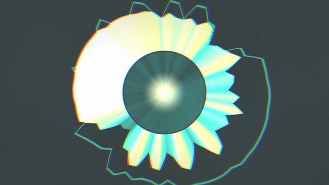
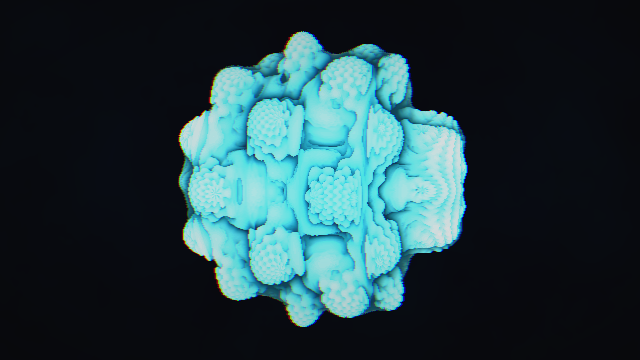
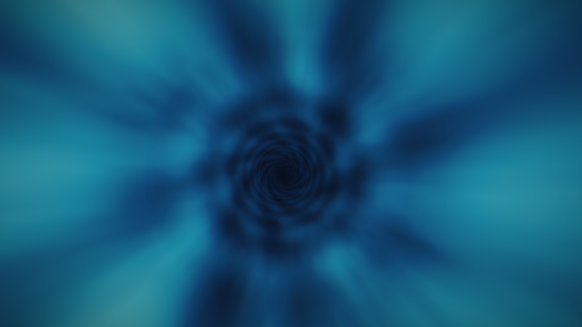

# Trance Music Generator

A Linux desktop studio (GTK 4 + libadwaita) that **learns how trance is built from your own music library,
composes brand-new tracks**, drops spoken phrases captured from the system audio into them, and renders
**MP3** or **MP4 with GPU visuals that follow the music**. Everything runs locally on one NVIDIA GPU.
Nothing is installed system-wide: the Python environment, ffmpeg, the AI models and all data live inside
this folder.



## What it does

1. **Learns from your library.** Import one track, one CD (a folder) or a whole collection (a folder of
   folders). Every track is split into drums / bass / other / vocals on the GPU (Demucs) and measured:
   tempo, beat grid, kick / snare / hat / bass patterns per bar, structure (intro, build, drop, breakdown,
   outro), key, bass movement. The result is a **style profile made of distributions**, not averages -
   "tempo 128-148 peaking at 140", "after a breakdown: 62 % drop, 24 % build", "kick 4/4 in 58 % of bars".
2. **Composes new tracks from that profile.** Tempo, structure, rhythms, key and chords are drawn from the
   profile for every track, so one track is 128 BPM with a long breakdown and a rolling bass and the next is
   145 with short drops. Transformation, not variation. Same seed = same track.
3. **Steals phrases.** Press Record, play a movie or a video, press Stop: the phrase lands in the bank, trimmed
   and normalised, with an editor to cut the start and the end. Phrases are dropped into new tracks where the
   structure asks for them - opening a breakdown or right before a drop - with EQ, echoes in time and ducking.
4. **Renders video.** Fourteen GLSL generators on the GPU (the six of Trance AutoDJ rewritten as shaders plus
   kaleidoscope, julia, mandelbulb, menger, metaballs, particles, spectrum, stills) driven by the composer's
   own timeline and the real audio spectrum: a pulse on every kick, a flash and a cut on every drop, calm liquid
   pictures in the breakdowns. Encoded with NVENC to MP4 in about a minute per track.
5. **Optional neural textures.** MusicGen clips generated from the plan, fitted to the tempo, looped under each
   section, high-passed and ducked so the kick and bass stay yours - with a dry copy for A/B listening.
   AI stills (SD-Turbo) for the video are optional too.

| | | |
|---|---|---|
|  |  |  |

## Requirements

- Linux with GNOME (Wayland or X11), PipeWire, and the GTK 4 / libadwaita Python bindings
  (`python3-gi gir1.2-gtk-4.0 gir1.2-adw-1` on Ubuntu / Debian).
- An NVIDIA GPU with 12 GB of memory and a recent driver (CUDA 12/13 capable). Demucs, MusicGen, SD-Turbo,
  the GLSL visuals and NVENC all run on it - one step at a time, never two models at once.
- About 25 GB of disk after the first run (PyTorch with CUDA, Demucs, MusicGen small models, SD-Turbo).

## Install and run

```bash
./install.sh            # everything into this folder; add --desktop for an applications-menu launcher
./trance-music-generator
```

Models download into `models/` the first time each feature is used. The in-app **Help** tab explains
every screen; the numbers behind the design are in [docs/MEASUREMENTS.md](docs/MEASUREMENTS.md).

## How it is built

Two interpreters, on purpose. The GUI runs on the system Python (the only one with GTK bindings) and never
imports torch; all heavy work runs as **jobs in a separate worker process** on the `.venv` interpreter, one
job at a time, with JSON-lines progress. The window never freezes and a crashed worker never takes the app
down. Every job writes its results to SQLite as it goes, so an analysis of thousands of tracks can be paused,
survive a reboot and resume.

```
env.sh                  every cache and model path points inside this folder
trance-music-generator  launcher (system python -> tmg.ui.app)
install.sh              one-shot setup on a fresh machine
tmg/
  paths.py config.py db.py log.py
  capture/              PipeWire capture (pw-record on the sink monitor), phrase bank, trim
  library/              scan (track / CD / collection), per-track analysis, style profile
  music/                synth + voices (from Trance AutoDJ), plan drawn from the profile, composer (+ timeline),
                        render (MP3/WAV + tags), phrases_mix, neural (MusicGen)
  visuals/              timeline signals, audio spectrum, palettes, shot sequencer, GLSL shaders, moderngl
                        engine, NVENC renderer, AI stills
  jobs/                 queue (GUI side), worker (.venv side), job kinds
  ui/                   GTK 4 pages: Phrases, Library, Compose, Jobs, Settings, Help
scripts/phase0/         the measurement scripts
tests/                  pytest suite (53 tests)
data/  models/  tools/  .venv/     created by install.sh, not in git
```

The **timeline** is the contract between the parts: the composer writes down every bar, beat, kick, fill,
riser, section and phrase; the visuals and the phrase placement read it instead of analysing the audio.

## Tests

```bash
source env.sh && .venv/bin/python -m pytest
```

The GPU tests (shaders, a short MP4) are skipped automatically where no EGL context is available.

## Related

[Trance AutoDJ](https://github.com/themechanic-dev/trance-autodj) is the 24/7 station this studio makes
material for. Its numpy synthesiser and its six procedural visuals are the ancestors of the composer and
of the shaders here.

---

<p align="center"><sub>HOME LAB &nbsp;·&nbsp; by the mechanic</sub></p>
